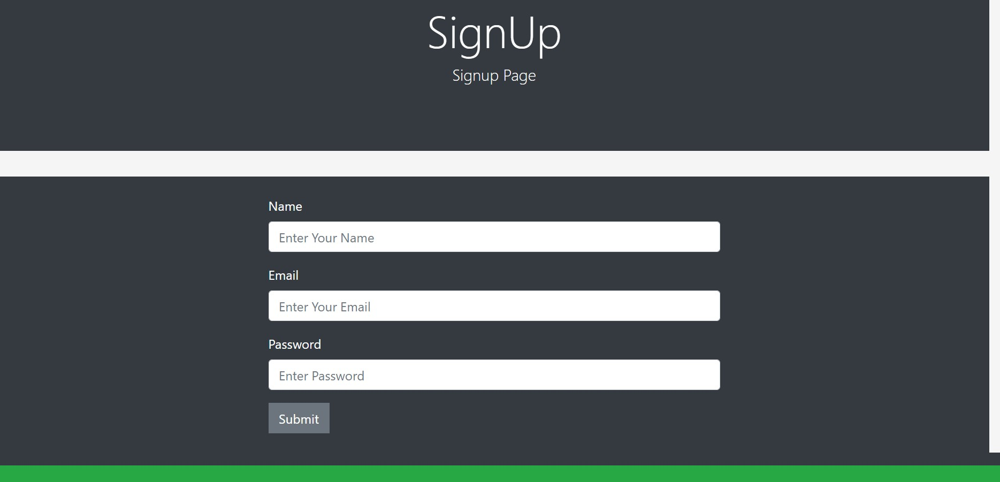
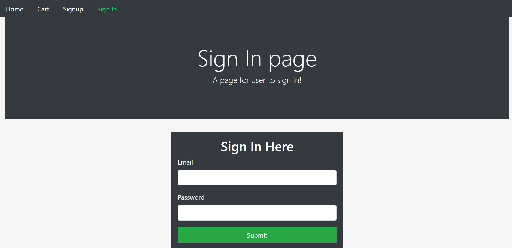
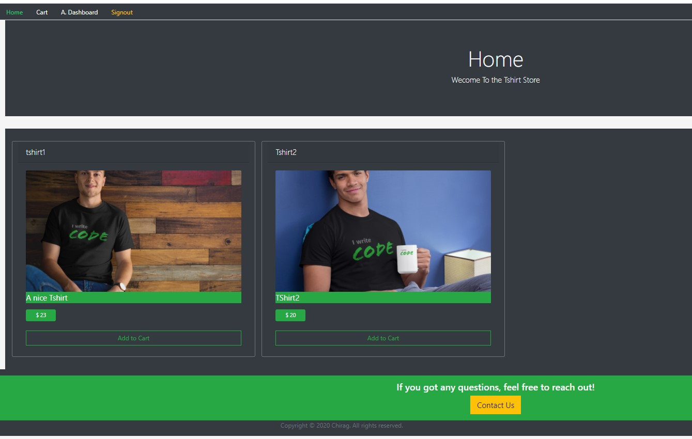
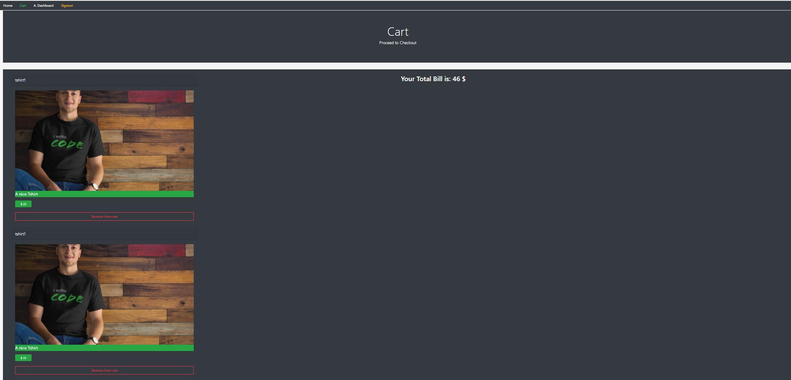
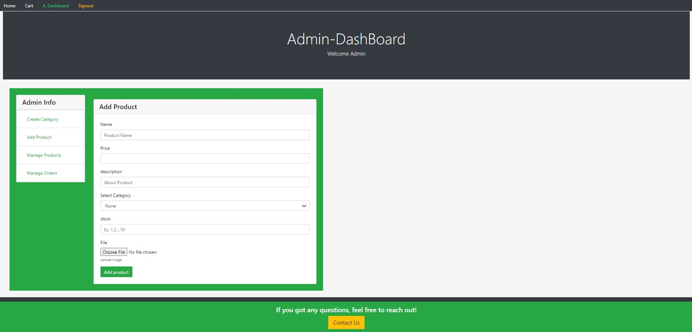
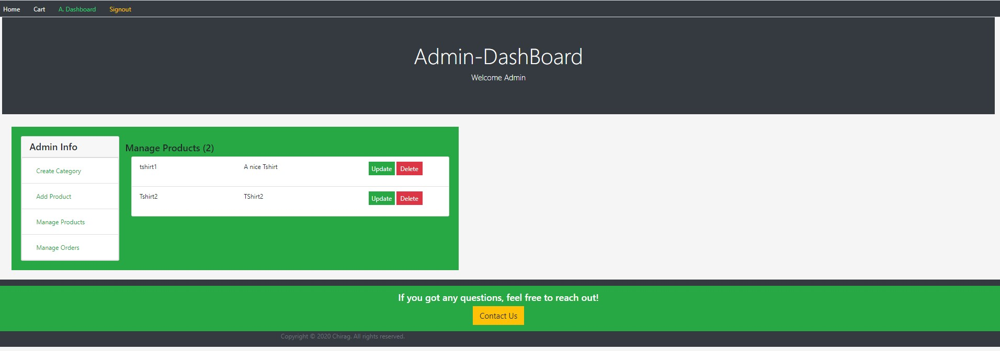
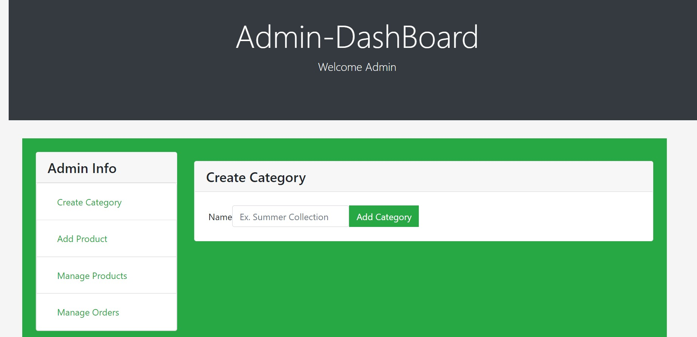

# A simple UI for a Shopping website

## Features

- SignUp Page
  
- SignIn Page
  
- User Page
  - Product Listing on HomePage
    
  - Cart with Total Bill
    
- Admin Page
  - Add Products
    
  - Update Products
    
  - Create categoriess
    
  - Manage Orders

## Available Scripts

In the project directory, you can run:

### `npm start`

### `npm test`

### `npm run build`
